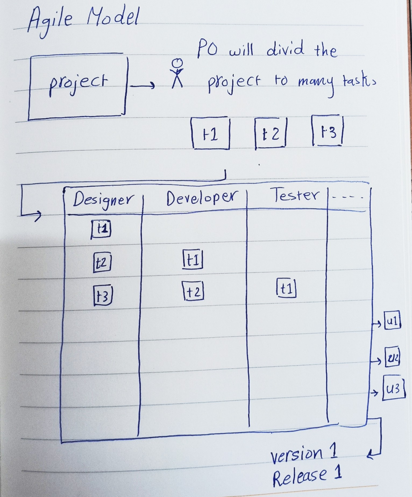

# _**Agile Method**_
**Definition:**
It is the process of dividing the project into parts and working on each part separately.

**Purposes:**
It help the team to work in flexible way and it improve the communication between the development team and product owner.

# _Agile VS Waterfall_

~~NOTE~~: 
1. Waterfall and Agile can be used for anything in life not just for the software.
2. The software life cycle phases are always the same the only thing change is the method used to execute them. 

## **Waterfall**

1. Advantage: 
   * Structured and predictable process.
   * Best for projects with well-defined and stable requirements.
   * Having full documentation of the project from the start.
2. Disadvantage:
   * Difficult to accept changes once a phase is completed.
   * Slow and takes a long time to complete the project.
3. Use csae: When the project is not divisible and must be completed in full before it can be released to the user.
4. Best practice:
   * Pharmaceutical industry such as Covid-19 vaccine
   * Government ministries because they do not face competition. As a result, they can afford to take extended      periods to transition their paperwork into a digital system or website.

**Waterfull Mechanism**

## **Agile**

1. Advantage: 
   * Easy and quick to implement because the project is divided into small parts and is released to the user in the form of versions.
   * Ability to adapt to changes and improvements at any stage of the development process.
   * Allowed all team members to work together at the same time.
2. Disadvantage:
   * Limited resources: The teams won’t know what their end result will look like from day one, it’s challenging to predict efforts like cost, time and resources required at the beginning of a project.
   * Limited documentation: documentation happens throughout a project, and often “just in time” for building the output, not at the beginning. As a result.
3. Use csae: When the project can be divided and launched in the form of versions or when the project owner is in a hurry and is trying to enter the market as soon as possible due to the presence of competitors in his field
4. Best practice:
   * Competitive companies such as Instagram, Google, etc.
   * Small companies that want to quickly enter the market by providing the most important services to the user and then devote themselves to adding the rest of the services

**Agile Mechanism**

# _The frameworks used for implementing agile_
There are many framework can be used to implement the Agile Method, some of them are the following:

1. Kanban
2. Lean
3. DSDM
4. Scrum

~~NOTE~~: The difference between Kanhan and Scrum is that Kanban does not contain a large number of meetings and the time is not specified and it follows these names: ToDo, InProgress, Testing, Done.

# _Scrum Framework for Agile_

## Scrum framework happen in many steps as the following:

1. The product owner will meet with the clinet to get his requirements which will be translated as task list which called in the scrum **"Product Backlog"**
2. The product owner will meet with technical team which known as **"Scrum"** and this meet called in the scrum **"Sprint Planning Meeting"** and they will decide which tasks they will work on in the next two week and this list called in the scrum **"Sprint Backlog"**
3. During the two weeks the team leader, known as **"Scrum Master"** will divide the tasks among the team members and at the beginning of each day the team will hold a quick meeting to follow up on the work and make sure there are no delays this meeting called **"Daily Scrum Meeting or Standup Meeting or Status Meeting"**.
4. After the two weeks is finised the technical team "Scrum" will meet again with product owner to delivery the task they finished and receive the tasks of the next two weeks and this meeting called **"Sprint Review"**.
5. At the same day of sprint review meeting the team will have anther meeting just for the team members to discuss the team's performance over the past two weeks and improve errors to increase the team's performance efficiency this meeting called **"Sprint Retrospective"**.
6. By this the steps will keep repeat until the project is finished.

~~NOTE~~: Both Backlog and User Stories are written by product woner.

**Backlog**

~~NOTE~~: 
1. Estimation: Task difficulty, Task weight.
2. Priority: Arrange tasks by importance.

**User Stories**

~~NOTE~~: 
1. Title: Task head.
2. User Story: Explain the task in the form of a story so that the developer can understand what it means.
3. Acceptance Criteria: Terms and Conditions for Accepting the task.
4. Estimation: Task difficulty, Task weight.
5. Priority: Arrange tasks by importance.
6. Description: Additional task description.

~~NOTE~~: Estimation Always take an odd number from 1 to 13. If an task appears with a grade higher than 13, the task is divided into two parts as it is larger than the acceptable size.
