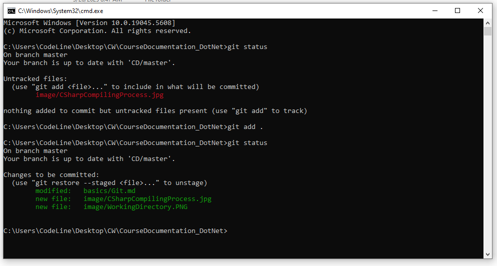
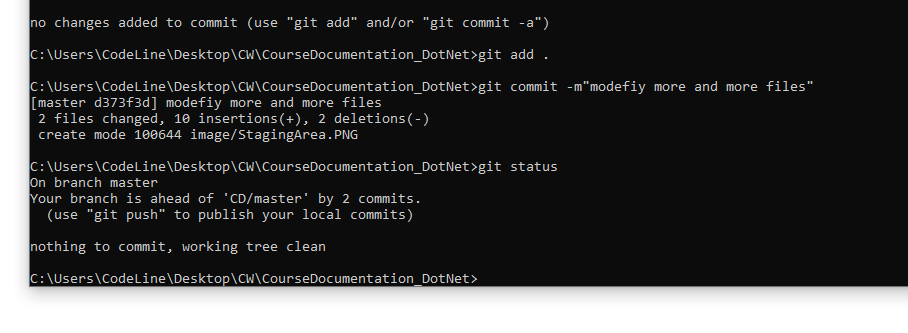
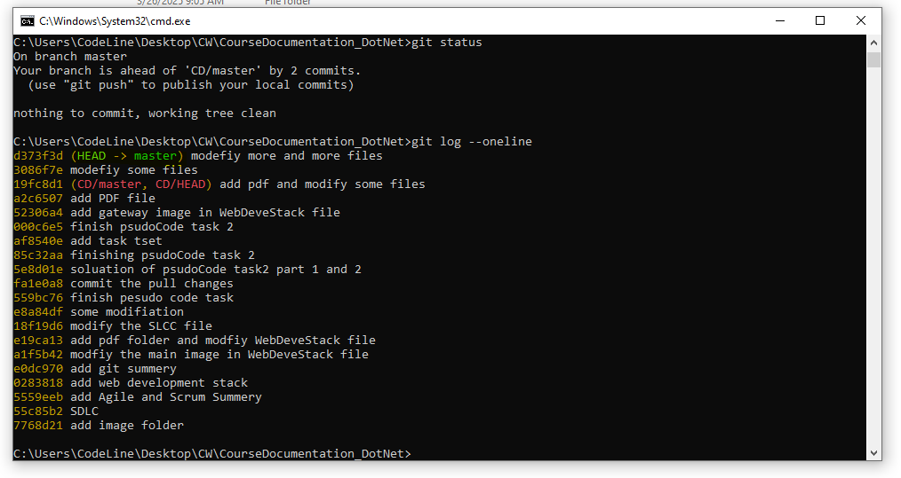

# _**Git Version Control**_

## **WHAT IS GIT :**
**Git** is a distributed version control system that enables software development teams to have multiple local copies of the project's codebase independent of each other. These copies, or branches, can be created, merged, and deleted quickly, empowering teams to experiment before merging into the main branch.

## **WHEN TO USE GIT :**
When we are working it time to tracking changes in the source code, which enable the team to work together on non-linear development.

## **WHY TO USE GIT :**
Because git will keep tricking all the changes you and your team members makes and it will store it as complete history of a project " versions" and when every you want to go back to the previous version you can easliy do that. 

## **TERMS RELATED TO GIT :**
There are so many terms related to git, Some of them are the following:
1. Repository.
2. Clone.
3. Branch.
4. Commit.

## **HOW GIT IS WORKING :**
**There four main stage in using git as the following:**
1. **Working Directory:** Its the workspace where the code can be modifiy and change without any restrictions, and usually the files will be shown in read color.

2. **Staging Area:** Its the space where the codes are rewiewed before saving them as a new copy of the project and also here no modification can be made to the written code, and to move our code into this stage we need to use this command  `git add .`  and usually the files will be shown in green color.

3. **Localrepo:** Its the space where the codes are saved as a new copy of the project and be ready to push to the remote repo, and to move our code into this stage we need to use this command  `git commit -m"our message"`  and usually the files will not be shown in this stage but it will tell us that **nothing to commit, working tree clean**.

4. **Remote Repo:** Its a remote space where the main project is stored so that all team members can share their work with the rest of the team and get the latest update from the project, and if we go to the github repo will see that the commit is increasing in number.

## Summary of the stages of Git work

## **THE CLOUD REPOSITORIES THAT USES GIT VERSION CONTROL :**

| Features                      | GitHub | GitLab | Bitbucket |
|-------------------------------|--------|--------|-----------|
| Free private repositories     | Yes    | Yes    | Yes       |
| Free public repositories      | Yes    | Yes    | Yes       |
| Merge Request/Issue Templates | Yes    | Yes    | No        |
| Integrated CI                 | No     | Yes    | Yes       |
| Open-source                   | No     | Yes    | No        |
| File storage                  | Yes    | Yes    | Yes       |
| Integrations                  | Yes    | Yes    | Yes       |
| Analytics                     | No     | Yes    | Yes       |

## **THE MOST COMMON COMMANDS USED IN GIT :**

| Commands                                            | Function                                                                                 |
|-----------------------------------------------------|------------------------------------------------------------------------------------------|
| git config --global user.name “RahmaAlmamari”       | set global user name for your PC                                                         | 
| git config --global user.email “rahma@gmail.com”    | link your PC with you account in remote repo using your email address                    |
| git init                                            | initialise the git system in your project working directory                              |
| git clone <url>                                     | to get a project from remote repo                                                        |
| git add <file.name>                                 | move one file to staging area                                                            |
| git add .                                           | move all the files you have to the staging area                                          | 
| git commit -m “message/comment/updates”             | move your work to localrepo by commit it and give it a message                           |
| git status                                          | list the files you have in working directory and staging area which are not commited yet |
| git log --oneline                                   | list all the commit you have created in your project                                     |
| git remote add <linkName> <url>                     | link your project with the remote repo you create for this project                       |  
| git remote                                          | list all link for remote repo you have in your PC                                        |
| git push <alias>                                    | upload work commited work to the remote repo                                             |
| git pull                                            | get or download the part you do not have in the main project which is in the remote repo |

## ~~ADDITIONAL NOTES:~~

**green line:** It represente my locl work where HEAD mean the last commit I add and master mean the projct it-self.
**read line:** It represente my remote work where CD mean the link name _the link name can be any thing_ and master mean the projct it-self.

In general, green line mean the last update for the project in my local machine and read line mean the last update for the project in the remote repo and if they are not in one line that mean every one of them in deferante update so in this case we need to do  `git push CD` so both locl project and remote project be in the same update.

