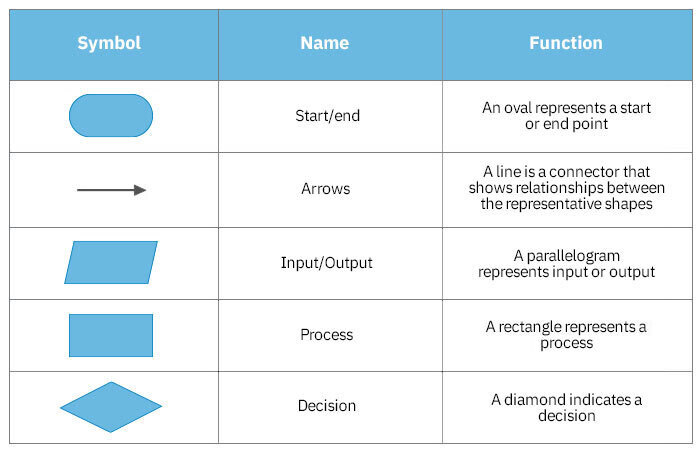

# Introduction to Algorithms 

**What is an Algorithm?**
is a step-by-step procedure to solve a problem or perform a task. It consists of finite, well-defined, 
and ordered instructions that take input, process it, and produce an output. 

**Example (Real-life Algorithm): making cakes**
1. Preparing Ingredients
2. Preparing Tools
3. Mix flour, sugar, eggs, baking powder, and water
4. Add flavoring to the mixture, such as chocolate or vanilla
5. Line baking paper in a baking dish
6. Pour the mixture into the dish
7. Place the mixture in the oven at 180°C for 20 minutes

## **Characteristics of a Good Algorithm**
1. Correctness – It should solve the problem correctly. 
2. Efficiency – It should run in a reasonable amount of time. 
3. Clarity – Easy to understand and implement. 
4. Finiteness – It must have an end. 
5. Generality – It should work for multiple inputs. 

**~~NOTE:~~**
1. Algorithms are presented using **pseudocode, Flow Chart** or implemented in a programming language.
2. Pseudocode is defined as a method of describing a process or writing programming code and algorithms using a natural language such as English.
3. A flowchart is a type of diagram that represents an algorithm, workflow or process.

_Flowchart Symbls:_



## **Types of Algorithms**

   **1. Sequential Algorithm (Step-by-step Execution):** An algorithm that follows a fixed sequence of steps. 
        
 _Example:_ Subtract two numbers?

   * Pseudocode: 
      1. take two numbers as input. 
      2. Add them together. 
      3. Return the sum.

   * Code:

```javascript

int sub(int a, int b)  
{  
return a - b;  
}


```  

   **2. Iterative Algorithm (Using Loops):** An algorithm that repeats a process multiple times using loops. 

 _Example:_ Finding the average of five student?

   * Pseudocode: 
      1. set average = 0 and sum = 0.
      2. start from student 1 do sum = sum + student_mark, repeat this process untill you reatch student 5. 
      3. divid sum by student number which in our case 5 and store the output in average.

   * Code:

```javascript

double student_mark, average;
double sum = 0;

for(int i=0; i<5; i++){
    sum = sum + student_mark;
}

average = sum / 5;

```  

   **3. Recursive Algorithm (Function Calls Itself):** An algorithm that solves a problem by calling itself with a smaller input. 

 _Example:_ Sum of Natural Numbers?

   * Pseudocode: 
     1. If the number is > 0 and < n, sum = sum + number. 
     2. Keep calling itself until reaching n, return the value of sum. 

   * Code:

```javascript

// Recursive function to find the sum of 
// numbers from 0 to n
using System;

class Program {
    public static int findSum(int n) {
      
        // Base case 
        if (n == 0) 
            return 0; 
        
        // Recursive case 
        return n + findSum(n - 1);
    }

    static void Main() {
        int n = 5;
        Console.WriteLine(findSum(n));
    }
}

```  

**[Algorithm exercises 1 in Pseudocode](../basics/PesudoCode.md).**

**[Algorithm exercises 2 in Pseudocode and flow chart](../basics/PesudoCode2.md).**
 

## **Algorithm  Components**  

There are several fundamental components are used to build an algorithm in programming, including variables, conditions, loops, functions, and more. 

  **1. Variables:** is a named storage location for data that holds values that can change during program execution. 

  _Example:_

```javascript

// Declare variables

int x;

// Assign vale to variables

x = 0;

// Update variables

x = x + 1; //x will be 1

```  

  **2. Input and Output statements:** Input allows users to enter data, and output displays data. 

  _Example:_

```javascript

// Read input from user than print it

int number;

console.WritLine("Enter a number:");

number = console.ReadLine();

console.WritLine("Your number is: " + number);

```  

  **3. Conditional Statements (Decision Making):** Conditional statements allow programs to make decisions based on conditions. 

   **_Type of conditional statements_** 

   * If-Else Statement 

  _Example:_

```javascript

int number;

console.WritLine("Enter a number:");

number = console.ReadLine();

if(number > 0){
console.WritLine("Your number is positive");
}
else {
console.WritLine("Your number is negative");
}
```  

   * Nested If-Else 

  _Example:_

```javascript

int age;

console.WritLine("Enter your age:");

number = console.ReadLine();

if(number <= 10){
console.WritLine("You are a child");
}
else if(number <= 18){
console.WritLine("You are a teenager");
}
else if(number <= 39){
console.WritLine("You are young");
}
else{
console.WritLine("You are an adult");
}
```  

  **4. Loops (Iteration):** Loops are used to repeat a block of code multiple times.  

   **_Type of loops_** 

   * While Loop: Repeats while a condition is true. 

  _Example:_

```javascript

int number;

console.WritLine("Enter a number:");

number = console.ReadLine();

while(number < 100){
    number = number + 5;
}

console.WritLine("Your number is:" + number);

```  

   * For Loop: Used when the number of iterations is known. 

  _Example:_

```javascript

for(int i=0; i<5; i++){
    console.WritLine(i);
}


```  

  **5. Functions (Procedures):** A function is a reusable block of code. 

  _Example:_ Function subtract two numbers

```javascript

int number1, number2;

console.WritLine("Enter the first number:");

number1 = console.ReadLine();

console.WritLine("Enter the second number:");

number2 = console.ReadLine();

sun(number1, number2);

funcrion sub(int x, int y){
    sum = x - y;
    return sum;
}

```  

  **6. Arrays and Lists:** Arrays store multiple values of the same type. 

  _Example:_ 

```javascript

int[] x = new int[3];

//to store x valus
for(int i=0; i<3; i++){
    x[i] = i+3;
}

//to print x value
for(int i=0; i<3; i++){
    console.WritLine(x[i]);
}

```  

## **Summary**

|Concept                |Purpose              |Example                                 |
|-----------------------|---------------------|----------------------------------------|
|Variables              |Store values         |x = 5                                   |
|Input/Output           |Get and display data |console.WritLine() , console.ReadLine() |
|Conditional Statements |Decision making      |if age >= 18 then ...                   |
|Loops                  |Repetition           |for i = 1 to 5 do ...                   |
|Functions              |Code reuse           |function add(a, b)                      |
 


 

