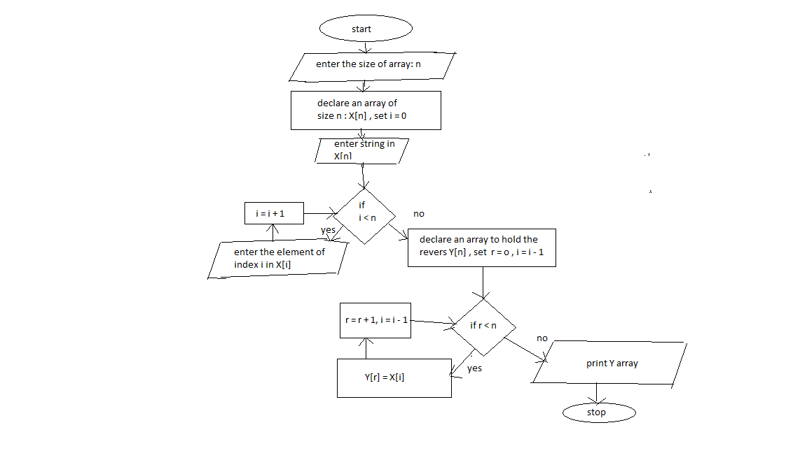

Task: design an algorith for each of the following tasks in both ( pesudo code and flowchart )
1. reverse a string

   1. set string as list X
   2. count the number of letters you have in your string and store it in count
   3. print X[count-1]
   4. repeat step 3 until count == 0 
   

2. search in list of student marks for the highest one

    1. set n where n is student number
    2. set student marks in S[i] where S = mark , i = 0
    3. set hig_mark = 0
    4. check if S[i] > hig_mark if yes hig_mark = S[i] , i+1
    5. if i < n repeat step 4 if not print hig_mark

3. sort the students marks from highest to lowest
4. check if number is palindrome ( ex: 3443 is palindrome , 56 is not palindrome , 454 is palindrome )