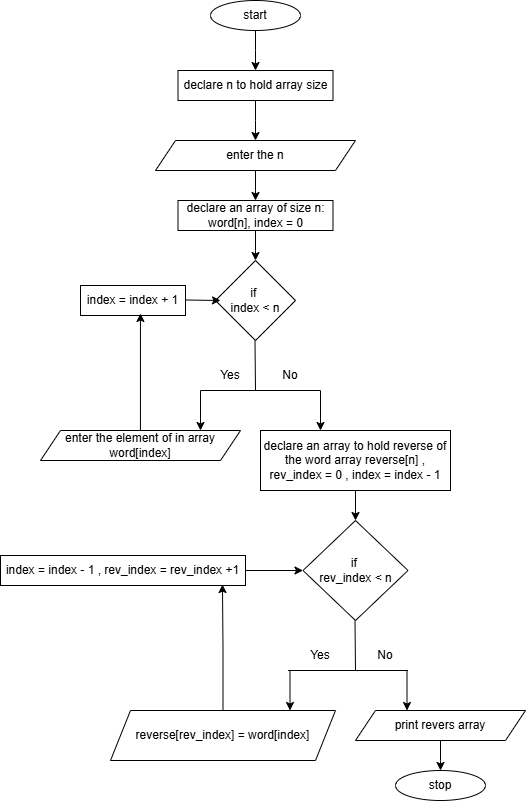
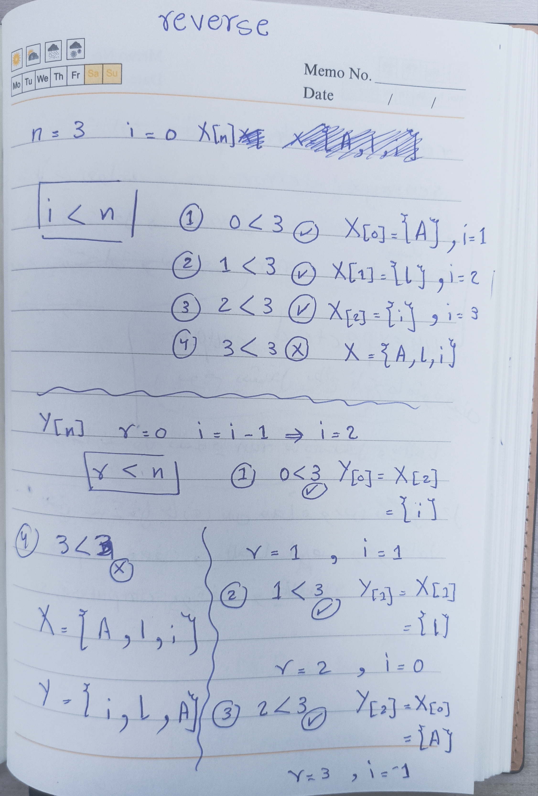
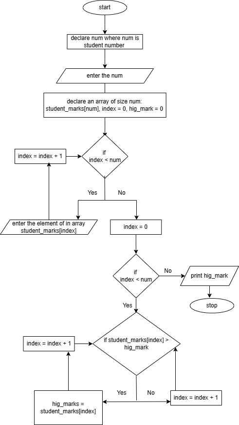
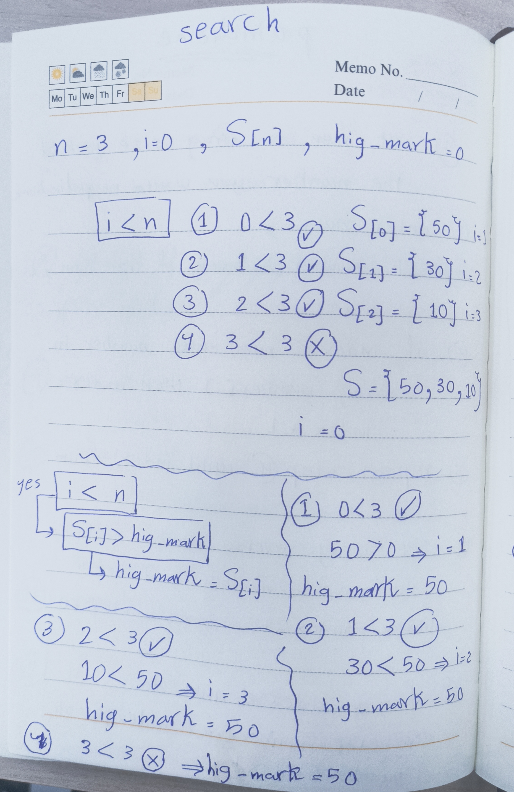
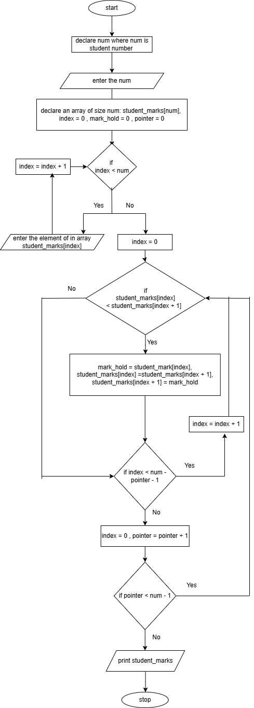
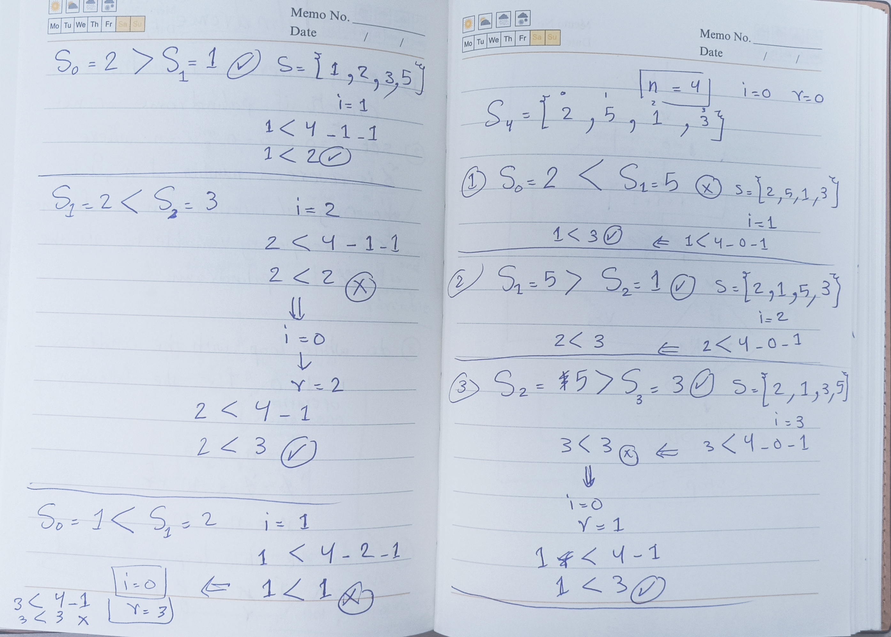
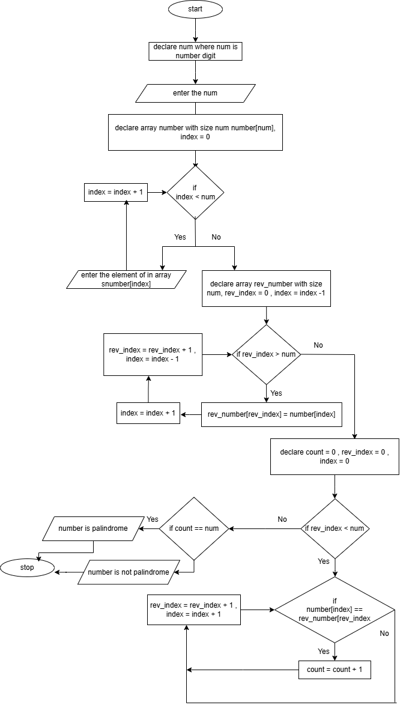
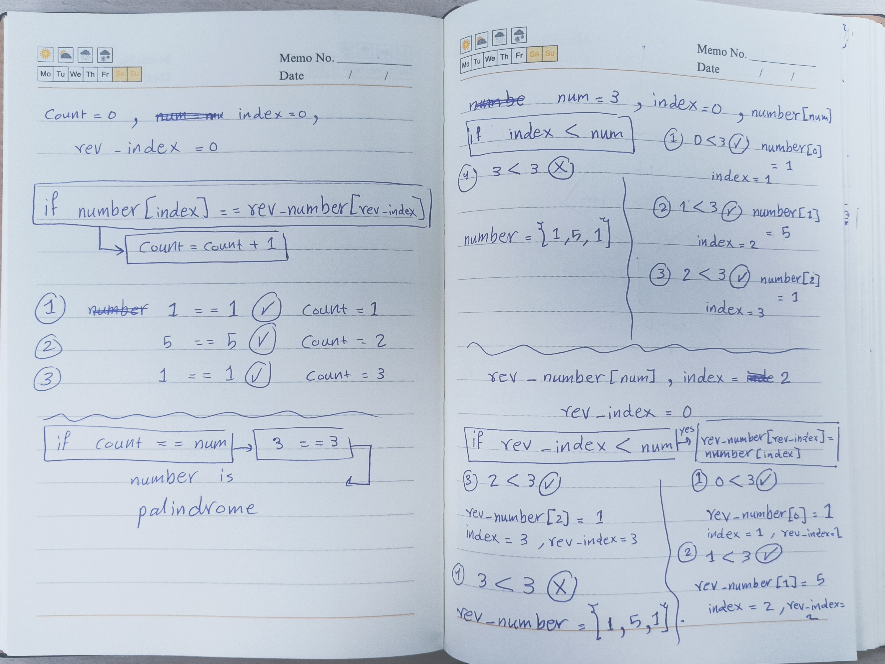

**Task: design an algorith for each of the following tasks in both ( pesudo code and flowchart )**

1. reverse a string?

   1. set string as list X
   2. count the number of letters you have in your string and store it in count
   3. print X[count-1]
   4. repeat step 3 until count == 0 

   
   

2. search in list of student marks for the highest one?

    1. set n where n is student number
    2. set student marks in S[i] where S = mark , i = 0
    3. set hig_mark = 0
    4. check if S[i] > hig_mark if yes hig_mark = S[i] , i+1
    5. if i < n repeat step 4 if not print hig_mark

    
    
    

3. sort the students marks from highest to lowest?

    1. set n where n is student number
    2. set student marks in S[i] where S = mark , i = index
    3. take the first element (S[0]) of student mark array S[n]
    4. compare the current element with the next element (S[1])
    5. if the current element is < the next element swap them by doing k = S[i], S[i] = S[i+1] and S[i+1] = k
    6. move to the next pair of element (S[1] and S[2]) and repeat steps 4 and 5
    7. repeat this process until you get to the end of the array (S[n]) at this point the lowest element will be at the last index (S[n-1]) 
    8. repeat steps 3 to 7 for the remaining unsorted elements
    9. repeat this process until the whole array is sorted

    

    **~~NOTE~~: This is test for sorte from lowest to highest**
    

4. check if number is palindrome ( ex: 3443 is palindrome , 56 is not palindrome , 454 is palindrome )

    1. set num as array size to hold the number you want to palindrome
    2. enter num
    3. set number as array of size num, set index = 0
    4. if index < num enter number in array number[index] then index = index + 1
    5. repeat step 4 until index == num
    6. set array reverse_number to hold the reverse number , set index = index - 1 and rev_index = 0
    7. if rev_index < num do reverse_number[rev_index] = number[index]
    8. repeat step 7 until rev_index == num
    9. set count = 0 , rev_index = 0 and index = 0
    10. check if number[index] == reverse_number[rev_index] do count = count + 1 , rev_index = rev_index + 1 , index = index + 1
    11. repeat step 10 until index == num
    12. if count == num print number is palindrome if not print number is not palindrome

    
    

