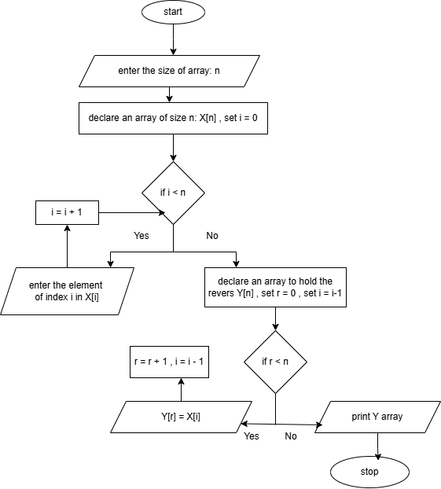
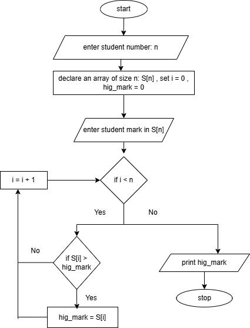
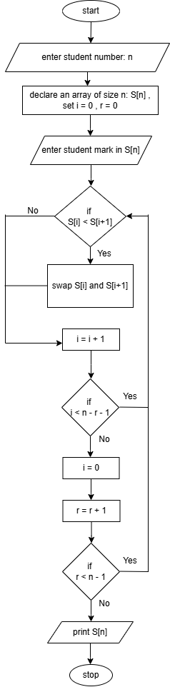
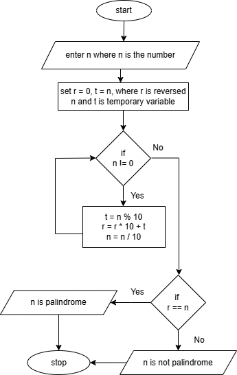

**Task: design an algorith for each of the following tasks in both ( pesudo code and flowchart )**

1. reverse a string?

   1. set string as list X
   2. count the number of letters you have in your string and store it in count
   3. print X[count-1]
   4. repeat step 3 until count == 0 

   

2. search in list of student marks for the highest one?

    1. set n where n is student number
    2. set student marks in S[i] where S = mark , i = 0
    3. set hig_mark = 0
    4. check if S[i] > hig_mark if yes hig_mark = S[i] , i+1
    5. if i < n repeat step 4 if not print hig_mark

    
    

3. sort the students marks from highest to lowest?

    1. set n where n is student number
    2. set student marks in S[i] where S = mark , i = index
    3. take the first element (S[0]) of student mark array S[n]
    4. compare the current element with the next element (S[1])
    5. if the current element is < the next element swap them 
    6. move to the next pair of element (S[1] and S[2]) and repeat steps 4 and 5
    7. repeat this process until you get to the end of the array (S[n]) at this point the lowest element will be at the last index (S[n-1]) 
    8. repeat steps 3 to 7 for the remaining unsorted elements
    9. repeat this process until the whole array is sorted

    

4. check if number is palindrome ( ex: 3443 is palindrome , 56 is not palindrome , 454 is palindrome )

     1. set n where n is number to check if palindrome or not
     2. set t = 0 , r = 0 and o = n where r is reversed number of n , o is the original number of n as reference , t is temporay variable to aply the logic for palindrome
     3. do while loop with the condition (n != 0) for the following operations:
         
         t = n % 10
         r = r * 10 + t
         n = n / 10 
    
      4. when the while loop is finished check if r == o print n is palindrome if not print n is not palindrome

    

