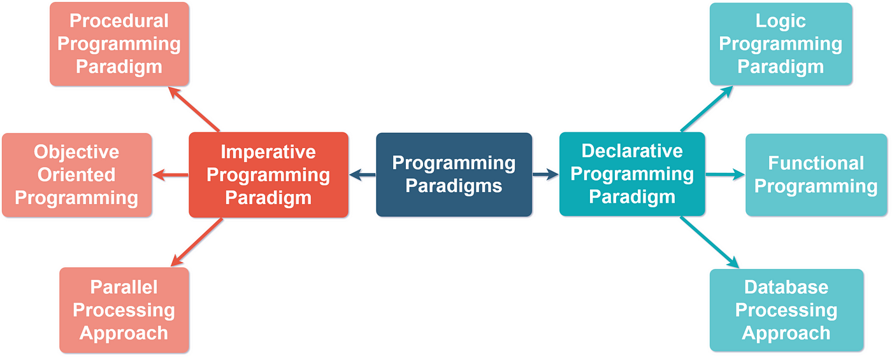

# Programming Paradigms




**Definition:** 

_Paradigm_ can also be termed as method to solve some problem or do some task. Programming paradigm is an approach to solve problem using some programming language or also we can say it is a method to solve a problem using tools and techniques that are available to us following some approach. There are lots for programming language that are known but all of them need to follow some strategy when they are implemented and this methodology/strategy is paradigms.

**Types:** 

   1. Imperative programming paradigm.
   2. Declarative programming paradigm.

## Imperative Programming Paradigm ... (how to do)

**Definition:** It performs step by step task by changing state. The main focus is on how to achieve the goal. It consist of several statements and after execution of all the result is stored.

**Advantages:**
1. Very simple to implement.
2. It contains loops, variables etc.

**Disadvantage:**
1. Complex problem cannot be solved using it.
2. Less efficient and less productive.
3. Parallel programming is not possible.

**Example in java programing language:**

```javascript

public class Main {
    public static void main(String[] args) {
        // Array to store marks
        int[] marks = {12, 32, 45, 13, 19};

        // Variable to store the sum of marks
        int sum = 0;

        // Variable to store the average
        float average = 0.0f;

        // Calculate the sum of marks
        for (int i = 0; i < 5; i++) {
            sum = sum + marks[i];
        }

        // Calculate the average
        average = sum / 5.0f;

        // Output the average
        System.out.println("Average of five numbers: " + average);
    }
}


```
_Output:_ 

` Average of five numbers: 24.2 `

**Imperative Types:**

  1. Procedural programming paradigm.
    
     * _The meaning of it:_ step-by-step approach, where programs are divided into procedures (also called functions or routines). It follows a top-down approach, focusing on a sequence of instructions that operate on data and it has a fixed number of steps where there is a clear beginning and end to the project. 

     * _Program language include:_ 
        
         - C 
         - C#
         - Java

     * _Example from real life:_  Withdraw money from the bank.

   2. Object oriented programming.
    
      * _The meaning of it:_  The program is written as a collection of classes and object which are meant for communication. The smallest and basic entity is object and all kind of computation is performed on the objects only. It works based on the concept of objects, which encapsulate data (attributes) and behavior (methods). It follows principles such as encapsulation, inheritance, polymorphism, and abstraction. OOP promotes reusability and modularity. 

      * _Advantages: 

          - Data security.
          - Inheritance.
          - Code reusability.
          - Flexible and abstraction is also present.

      * _Program language include:_ 
        
         - C++ 
         - C#
         - Java
         - Python 

      * _Example from real life:_  It can handle almost all kind of real life problems which are today in scenario.

 3. Parallel processing approach.

    * _The meaning of it:_ Just like procedural but it run multipe instructions in the same time to improve performance and efficiency.

     * _Program language include:_ 
        
         - C 
         - C++
         - NESL (one of the oldest one).


## Declarative programming paradigm ... (what to do)


**Definition:**  It’s a style of building programs that expresses logic of computation without talking about its control flow, focuses on what the outcome should be rather than how to achieve it.  

**Declarative Types:** 

  1. Logic programming paradigms.
    
     * _The meaning of it:_ Relies on set of facts and rules to build conclusions.

     * _Example from real life:_  commonly used in artificial intelligence, knowledge representation, and expert systems (roport), Such as: Prolog.

  2. Functional programming paradigms.

     * _The meaning of it:_ It treats computation as the evaluation of mathematical functions, avoiding changing state and mutable data. It focuses pure functions, immutability, and higher-order functions. 

     * _Example from real life:_  commonly used in data processing and mathematical computations, Such as Haskel.

  3. Database/Data driven programming.

     * _The meaning of it:_ A programming approach where the flow and logic of the application are determined by data stored in a database rather than by hardcoded logic, A database program is the heart of a business information system and provides file creation, data entry, update, query and reporting functions.

     * _Example from real life:_  commonly used in web applications, business software, and enterprise systems where structured data management is essential, Such as SQL.


```javascript

CREATE DATABASE databaseAddress;
CREATE TABLE Addr (
    PersonID int,
    LastName varchar(200),
    FirstName varchar(200),
    Address varchar(200),
    City varchar(200),
    State varchar(200)
); 


```
