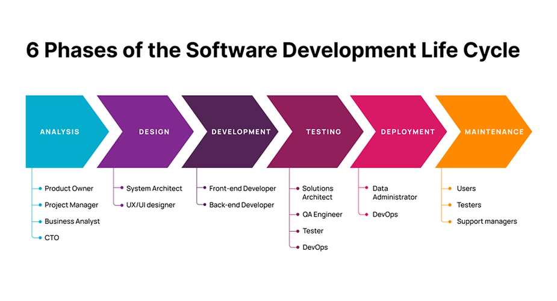

# _Softwate Development Lif Cycle (SDLC)_

## **Analysis**
     1. Explain: In general its when we try to understand something complex in order to Know its nature and     features and benefit from it.
     2. Role: In this phase we will gather the information about the project from the client or stakeholderand and  their requirements and translate them into a tasks and user stories which can be understand by the technical teams.
     3. Its input in SDLC: Client requirements. 
     4. Its output in SDLC: Tasks and user stories.
### Analysis titles:
1. Business Analyst
   * responsibility:
       He is the one who meet with client or stakeholder and he need to be familiar with the scope of the project the client seeks to implement also he is responsible of gathering the client requirements.
2. Product Owner
    * responsibility:
       He is responsible of translate the business needs to functional specifications, user stories which the technical team can understand.
3. Project Manager
    * responsibility:
       He is responsible of managing project time line which mean when every part of the project will be start and finish and which part is more important than the other parts. 

~~NOTE~~: All these three-job title can be combined under one of them. Also, **they are using tool like trello, tfs, azure devops and jira**.

4. CTO
    * responsibility:
       He is the highest-ranking person in terms of position and he is the decision maker, his role is advisory rather than executive.

## **Design**
     1. Explain: In general its when we visualize complex concepts into simple illustrations so that they reflect the real concept through them.
     2. Role: In this phase we will design the structure of the code and also we will draw the inteface of the web app and determain how the user will move from one page to anther.
     3. Its input in SDLC: Tasks and user stories. 
     4. Its output in SDLC: Code structure and interface prototype.

### Design titles:
1. System Architect
   * responsibility:
       He is the one who will design the structure of the code, he will determine how the code will be divided, where the data will be stored and how also what he will done the back-end developer will implement and **one tool can be used here is TOGAF**.
2. UI Design “User Interface Design” 
   * responsibility:
       He does not have to be from a technical background but he must have the knowledge od drawing and dealing with colors and coordination in general and **one tool can be used here is Figma**.
3. UX Design “User experience Design” 
   * responsibility:
       He is the one who will determine how the user will navigate between the pages of the web app, he always tries to make the user navigation as easy as possible by making him reach the service he wants in the fewest possible steps and **one tool can be used here is wireframe**.

~~NOTE~~: The result of UI\UX design will be given to the front-end developer to implement.

## **Development**
     1. Explain: In general its a set of steps or stages to create something.
     2. Role: In this phase we will start writing the code which will draw the web app and give it the ability to interacts with users.
     3. Its input in SDLC: Code structure and interface prototype. 
     4. Its output in SDLC: The project as web app in the form of a test sample.

### Development titles:
1. Front-end Developer
   * responsibility:
       He is the one who draw the web app using code so whatever the user see is done by him **one tool can be used here is VS Code**.
2. Back-end Developer 
   * responsibility:
       He is the one who do the code that make the web app work so every action the web app do is done by him **one tool can be used here is VS Code**.

~~NOTE~~: 
1. Laravel and .Net are framework for back-end developer however Bootstrap, React, Angular and MudBlazor are framework for front-end developer.
2. Back-end contain three parts: database, programming language and framework.

## **Testing**
     1. Explain: In general its the process of testing a target or set of evaluation targets on the product we have to try to compare the result we get with the result we expected.
     2. Role: In this phase we will try all the cases that the user is expected to execute and we will see if the web app will respond correctly.
     3. Its input in SDLC: The project as web app in the form of a test sample.
     4. Its output in SDLC: The project as web app in the form of a verified sample.

### Testing titles:
1. Solution Architect
   * responsibility:
       He is the one who determines the criteria for the success or failure of web app **some tool can be used: Jenkins, Docker and Ansible**.
2. QA Engineer 
   * responsibility:
       He is the one who monitors the implementation process of each phases in SDLC to ensure that every phases is done based on quality standards **one tool can be used: QTest**.
3. Tester 
   * responsibility:
       He is the one who ensures that the web app services are working properly **Everything and everyone is a tool .. some tool can be used: Selenium, Firebug and OpenSTA**.
4. Tester 
   * responsibility:
       He is the one who have combines developmenet and operations skills to increase the efficiency, speed and security of the web app **one tool can be used: Jenkins**.

~~NOTE~~: 
Testing Type:
1. Self-testing: the web app test it-self.
2. Developer testing: developer test the code.
3. Integration testing: it is when we test the code after we combine two parts or more together.
4. Full testing: it is when we test the web app after it is done.

## **Deployment**
     1. Explain: In general its the process of publishing the product to the user.
     2. Role: In this phase we will upload the web app to a server so the user can access and use it.
     3. Its input in SDLC: The project as web app in the form of a verified sample.
     4. Its output in SDLC: Public web app which everyone can access.

### Deployment titles:
1. DevOps
   * responsibility:
       He is the One who publish the web app code so every one can access to it and use it **one tool can be used: Jenkins**.
2. Data Administrator 
   * responsibility:
       He is the one who take cares about the data and deal with the database and keep everything safe **one tool can be used: native**.

~~NOTE~~: In this phase we will publish the web app so everyone can use it and this is done using hosting and domain which happen in the server and most of the server run using Linux. 

## **Maintenance**
     1. Explain: In general its the process of correcting the errors that the user may face while using the product and its improving some elements that would improve the product.
     2. Role: In this phase we will correct the errors that the user may face while using the web app using log mechanism to track the user movements.
     3. Its input in SDLC: User errors.
     4. Its output in SDLC: Public web app after correcting the errors that appeared to the user.

### Maintenance titles:
1. Users
   * responsibility:
       He is the one who will face the error while using the web app **as a tool you can call the phone support number, send email to support teams**.
2. Testers
   * responsibility:
       He is the one who will fix the error the user face **one tool can be used: log**.
3. Support Managers
   * responsibility:
       He is the one who supervises the tester who is responsible for correcting errors that may appear to the user and he always try to provide their teams with resources, training and motivation to support their clients and resolve problems quickly **tool: Employee scheduling software ex: Assembled | Feedback tools to collect CSAT, NPS, and CES data ex: Nicereply**.

