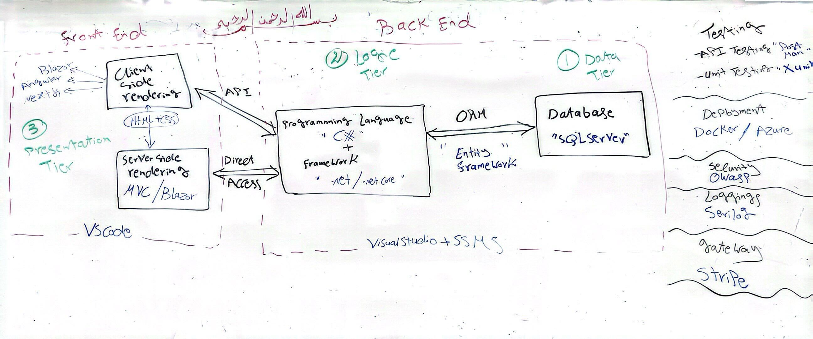

# _Web Developmenet Stack_

## **Web Application Parts and Services**

All web app divided inti three parts as the following:
1.  **_Data Tier:_** Its the place where we store and deal with data, We call the memory storage **"Database"**.
2.  **_Logic Tier:_** It work as link between the data tier and presentation tier and its responsible for prefoming operations and verifying permissions, We call it **"Programming Language and Framework"**.

~~NOTE~~: 
1. Data tier with logic tier togather called **Back-End**.
2. In the logic tier we always do one of the following operations which called **"CRUD Operations"**:
    * Create or Store.
    * Read or View.
    * Update or Edit.
    * Delete or Remove.

3.  **_Presentation Tier:_** Its deal with web app presentational and how it will look like for the users, Its called **"Front-End"** and we have two type for it:
   * _Client Side:_ The whole code for drawing the web app will be sending to the user and it will run from his PC to show the web app, **Some tools for it: Blazor, Angular and Nextjs**, There are so many web app used this method like YouTube.
   * _Server Side:_ The code which is responsible for drawing the web app will be run in the company server then it will send an image for the user to access, **Some tools for it: MVC and Blazor**, There are so many web app used this method like Amazon.

~~NOTE:~~ 
1. Every one of these tiers store in different places so, If one of them stop working or go throw a problem the other tiers do not stop as well.
2. In the presentation tier we always have three parts: HTML, CSS and JS. Both HTML and CSS are not changing in client side and server side, However where the JS will be draw will determine if yhe web app will be client side or server side.

## **The Most Popular Web Stack Now a Days**
 1. **.Net Stack**
    * _Where to use:_ To bulid most of the apps like 'Web app, Mobile app, Desktop app, Embedded systems and Console app.
    * _When to use:_ To bulid huge and large projects that must be organized, such as the project of interprice companies.
    * _Features:_ 
       * Because it is well organized this makes it safer.
       * It supports many class libraries, APIs, programming languages all within Visual Studio IDE.   

 2. **Java Stack**
    * _Where to use:_ To bulid most of the apps like 'Web app, Mobile app, Desktop app, Embedded systems and Console app.
    * _When to use:_ To bulid huge and large projects that must be organized, such as the project of interprice companies.
    * _Features:_ 
       * Because it is well organized this makes it safer.
       * "Scalability" it is designed to be highly scalable which makes it to suitable for any business type from small to large enterprises.  

 3. **Laravel Stack**
    * _Where to use:_ To bulid most of the apps like 'Web app, Mobile app, Desktop app, Embedded systems and Console app.
    * _When to use:_ To bulid huge and large projects that must be organized, such as the project of interprice companies.
    * _Features:_
       * MVC Architecture Support through Built-In Functions. 
       * Strong Application Security.
       * Authorization Technique for Coding.

 4. **Python Stack**
    * _Where to use:_ To bulid most of the apps like 'Web app, Mobile app, Desktop app, Embedded systems and Console app.
    * _When to use:_ To bulid easy and fast project like real itme project "zoom" and project which deal with data using AI, Its unorganized and random, Which makes it less     secure so it is usually used for small projects.
    * _Features:_
       * Free and Open Source. 
       * Easy to write and read the code.
       * Easy integrate with other languages like C, C++, etc.

## **Tool of .Net Stack**

| .No | Parts Name | Tool Name |
|-----|------------|-----------|
|  1  | **Database**  | SQL Server |
|  2  | **Programming Language** | C# |
|  3  | **Framework** | .Net/ .Net Core |
|  4  | **APT** | Post Man |
|  5  | **Client Side Rendering** | Blazor/ Angular/ Nextjs |
|  6  | **Server Side Rendering** | MVC/ Blazor |
|  7  | **ORM** | Entity Framework/ Dapper |
|  8  | **Back-End** | VisualStudio and SSMS |
|  9  | **Front-End** | VSCode |